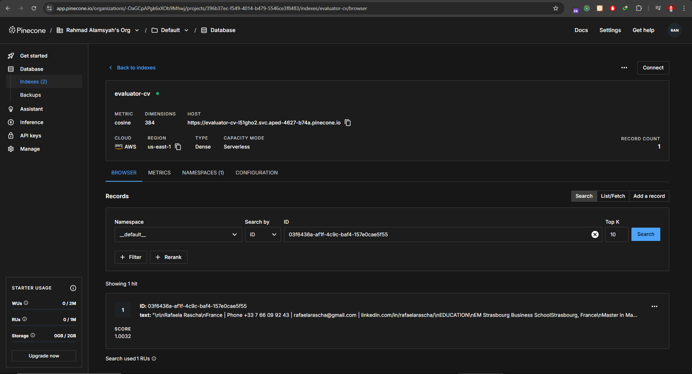

# Next.js CV Evaluator

This project is a Next.js application that allows users to upload CVs, evaluate them against job vacancy descriptions, and retrieve match rates and scoring using a rule-based AI workflow. It uses Pinecone for vector storage and supports async evaluation simulation.

## Features

- Upload CVs in various formats (PDF, DOCX, plain text)
- Store CVs as vector embeddings in Pinecone
- Evaluate CVs against job descriptions using custom scoring logic
- Retrieve evaluation results with match rates, feedback, and project scoring
- Simulate async evaluation status (processing/completed)
- Includes UI screenshots in the `public/screenshots` folder

## Project Structure

```
match-job-ai
├── public
│   └── screenshots
│       ├── upload-cv.png
│       ├── evaluate-cv.png
│       └── get-results.png
├── src
│   ├── app
│   │   ├── api
│   │   │   ├── upload-cv
│   │   │   │   └── route.ts
│   │   │   ├── evaluate-cv
│   │   │   │   └── route.ts
│   │   │   └── get-results
│   │   │       └── route.ts
│   │   ├── types
│   │   │   └── index.ts
│   │   ├── utils
│   │   │   ├── aiEvaluator.ts
│   │   │   └── fileHandler.ts
│   │   └── workflows
│   │       └── llmPrompt.ts
├── package.json
├── tsconfig.json
├── .env
└── README.md
```

## Vector Database



CV save on Pinecone vector database

## Installation

1. Clone the repository:

   ```
   git clone <repository-url>
   cd match-job-ai
   ```

2. Install dependencies:

   ```
   npm install
   ```

3. Start the development server:
   ```
   npm run dev
   ```

## API Endpoints & POSTMAN Usage

### 1. Upload CV


- **Endpoint:** `POST /api/upload-cv`
- **Description:** Uploads a CV file, extracts text, stores embedding in Pinecone, and returns a vector ID.
- **POSTMAN Example:**

  - Method: POST
  - URL: `http://localhost:3000/api/upload-cv`
  - Body: form-data
    - Key: `cv` (type: File)
    - Value: Select your CV file

- **Response:**
  ```json
  {
    "message": "CV uploaded and indexed.",
    "vectorId": "your-vector-id"
  }
  ```

---

### 2. Evaluate CV


- **Endpoint:** `POST /api/evaluate-cv`
- **Description:** Initiates evaluation of the uploaded CV using the vector ID and job description. Returns evaluation status.
- **POSTMAN Example:**

  - Method: POST
  - URL: `http://localhost:3000/api/evaluate-cv`
  - Body: raw, JSON
    ```json
    {
      "vectorId": "your-vector-id",
      "jobDescription": {
        "title": "Backend Developer",
        "requirements": ["Node.js", "TypeScript", "Cloud", "AI Integration"],
        "description": "Responsible for backend development and AI workflow integration."
      }
    }
    ```

- **Response (initial):**
  ```json
  {
    "evaluationId": "your-vector-id",
    "status": "processing"
  }
  ```

---

### 3. Get Results


- **Endpoint:** `GET /api/get-results?id=your-vector-id`
- **Description:** Retrieves the evaluation result for the given evaluation ID.
- **POSTMAN Example:**

  - Method: GET
  - URL: `http://localhost:3000/api/get-results?id=your-vector-id`

- **Response (processing):**
  ```json
  {
    "evaluationId": "your-vector-id",
    "status": "processing"
  }
  ```
- **Response (completed):**
  ```json
  {
    "evaluationId": "your-vector-id",
    "status": "completed",
    "result": {
      "evaluationId": "your-vector-id",
      "matchRate": 0.82,
      "cv_feedback": "Strong in backend and cloud, limited AI integration experience.",
      "project_score": 7.5,
      "project_feedback": "Meets prompt chaining requirements, lacks error handling robustness.",
      "overall_summary": "Good candidate fit, would benefit from deeper RAG knowledge.",
      "status": "completed"
    }
  }
  ```

## Usage Examples

### Uploading a CV

Use Postman to send a POST request to `/api/upload-cv` with your CV file as form-data.

### Evaluating a CV

Copy the `vectorId` from the upload response and send a POST request to `/api/evaluate-cv` with the job description.

### Retrieving Results

Send a GET request to `/api/get-results?id=your-vector-id` to get the evaluation results.

## License

This project is licensed under
